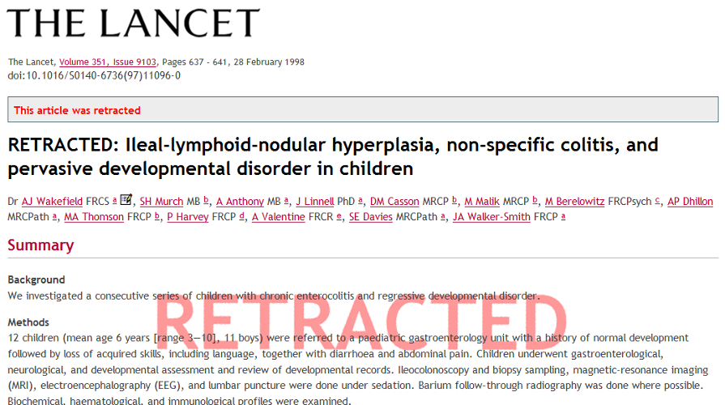
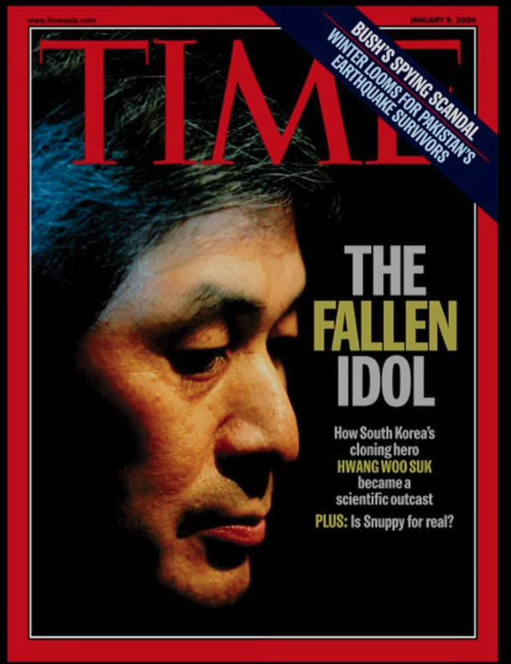
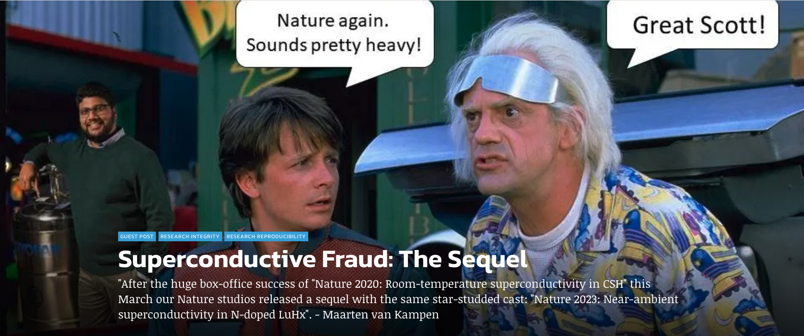

# Week 5: Academic and Research Integrity
**NASC 094: Adventures in Science: DTSC**

*Spring 2026*

---

## Three Cases That Changed Science
Integrity violations are not abstract.
They have ended careers, misled entire fields, and in some cases directly harmed people.

The three cases below are among the most consequential research fraud scandals of the past 30 years.
Each one shows what happens when a researcher puts ambition or self-interest ahead of honesty.

---

## Andrew Wakefield (1998): The Vaccine-Autism Fraud

* **The claim:** A 1998 paper in *The Lancet* alleged a link between the MMR vaccine and autism, based on just 12 children.
* **The fraud:** Investigative journalist Brian Deer revealed Wakefield had falsified patient data, cherry-picked cases to fit his narrative, and had undisclosed financial ties — he was being paid by lawyers suing vaccine manufacturers.
* **Outcome:** The paper was retracted in 2010. Wakefield lost his medical license. The fraud seeded the modern anti-vaccine movement, leading to resurgences of measles and other preventable diseases worldwide.

---

## Hwang Woo-suk (2004–2005): The "King of Cloning"

* **The claim:** Papers in *Science* announced the world's first patient-specific cloned human embryonic stem cells — celebrated as a national achievement in South Korea.
* **The fraud:** A whistleblower revealed the stem cell lines were entirely fabricated. Hwang also coerced female subordinates in his lab to donate eggs for the research.
* **Outcome:** Both papers retracted. Hwang was fired and later received a suspended prison sentence for embezzlement and bioethical violations.

---

## Ranga P. Dias (2020–2024): Room-Temperature Superconductivity
{: width="50%"}

* **The claim:** Papers published in *Nature* in 2020 and 2023 claimed discovery of room-temperature superconductivity — widely described as the "holy grail" of physics.
* **The fraud:** Investigations found evidence of data fabrication and manipulation across multiple papers. Dias attributed chart inconsistencies to "Adobe Illustrator."
* **Outcome:** Multiple papers retracted. As of 2024–2025, Dias was removed from his faculty position at the University of Rochester.

---

## Why Integrity Matters
Science depends on **trust**.

When researchers publish results, other scientists, doctors, policymakers, and the public rely on those results being **honest and accurate**.

A single act of misconduct can:
* mislead other researchers who build on flawed work,
* harm people who rely on incorrect conclusions,
* and damage the reputation of an entire field.

Integrity is not just about following rules.
It is about being the kind of scientist whose work others can trust.

---

## Academic Integrity: Core Concepts
The most common forms of academic misconduct are:

* **Plagiarism:** presenting someone else's words, ideas, or work as your own without proper credit.
* **Fabrication:** inventing data, results, or sources that do not exist.
* **Falsification:** manipulating data, images, or results to misrepresent what actually happened.
* **Facilitating misconduct:** helping someone else cheat.

These apply to papers, homework, lab reports, presentations, and code.

UCR policy: [conduct.ucr.edu](https://conduct.ucr.edu/)

---

## A Common Gray Area: Selective Reporting
One of the most widespread integrity problems in data science is **selective reporting**.

This happens when a researcher:
* runs many analyses and only reports the one that looks good,
* removes data points that make results weaker without disclosing it,
* or adjusts the research question after seeing the results.

This is sometimes called **p-hacking** or **HARKing** (Hypothesizing After Results are Known).

It may not feel like cheating, but it distorts the scientific record just as much as fabrication.

---

## AI and Integrity
AI tools including large language models raise new questions about academic integrity.

Things to keep in mind:
* Submitting AI-generated text as your own writing is a form of academic dishonesty if the assignment expects your own work.
* AI can confidently produce incorrect citations, statistics, and claims. You are responsible for verifying everything you submit.
* Using AI to help you think, outline, or get feedback is generally fine. Using it to do the work for you is not.
* When in doubt, ask your instructor. Policies vary by course and assignment.

The core question remains the same: **is the work honestly yours?**

---

## Group Scenario Work
You will work in your groups for about 10 minutes.

Each group will discuss one scenario, then share their thinking with the class.

For your scenario, discuss:
1. What went wrong, and why is it a problem?
2. Who is harmed, and how?
3. What should the person have done instead?
4. Is there anything that makes this situation more complicated or ambiguous?

---

## Scenario A — Selective Data Removal
*(Group 1)*

A student collects survey data for a class project on study habits and GPA.
After looking at the results, she notices that two responses look unusual and make her main finding disappear.
She removes those two responses from her dataset and does not mention this in her write-up.
Her conclusion now shows a clear, significant relationship.

Discuss: What did she do wrong? Who is harmed? What should she have done?

---

## Scenario B — Unattributed AI Writing
*(Group 2)*

A student is assigned a one-page reflection on career goals.
He pastes the assignment prompt into ChatGPT, lightly edits the output, and submits it.
The writing sounds polished. He does not mention using AI anywhere in the submission.

Discuss: What did he do wrong? Is this plagiarism? What should he have done instead?

---

## Debrief
Each group shares their scenario and key conclusions.

Some themes that often come up:
* Integrity violations exist on a spectrum from clear-cut to genuinely ambiguous.
* Many violations happen not out of malice but out of pressure, convenience, or not knowing the rules.
* The standard is not "did I intend to cheat?" but "does this work honestly represent what I did?"
* When you are unsure, the right move is almost always to ask your instructor or advisor.

---

## Wrap-Up
Today's main ideas:

* Integrity is foundational to science. Without it, results cannot be trusted or built upon.
* The same principles apply to student work and professional research.
* Selective reporting, undisclosed AI use, and misrepresenting contributions are real and common problems.
* If you are ever unsure whether something is acceptable, ask before submitting.

Next week we will hear from alumni guest speakers about science careers.
